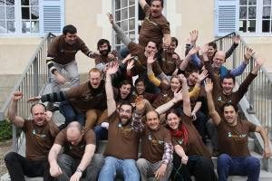

## Quoi ?

Opération Libre c'est 48 heures d'animations participatives.

Pour collecter et libérer les informations et outils d'une commune.

Avec les habitants, des associations et contributeurs.

## Qui ?

L'Opération Libre est une initiative d'organisations travaillant autour des [outils, licences, contenus et données libres](http://enacit.epfl.ch/logiciel-libre/). Elle a pour objectif de démontrer les opportunités de la libre diffusion des outils et informations des communes. 

## Comment ?

Nous invitons les contributeurs de projets libres, les historiens, géographes, botanistes, développeurs, cartographes, photographes, designers, traducteurs, vidéastes, professionnels ou en herbe... et tous les curieux à nous rejoindre sur les animations :

* Créer des cartes du territoire basées sur [Openstreetmap](http://www.openstreetmap.fr/ "Site d'Openstreetmap")
* Prendre des photographies et les partager librement sur [Commons](https://commons.wikimedia.org/wiki/Accueil "Site de Commons")
* Rédiger des articles historiques de la commune sur [Wikipedia](https://fr.wikipedia.org/wiki/Wikip%C3%A9dia:Accueil_principal "Site de Wikipedia")
* Répertorier la faune et flore locale sur [Tela Botanica](http://www.tela-botanica.org/ "Site de Tela Botanica") 
* Imprimantes 3D, films, Drônes, vues aériennes, et bien plus encore !

## Pour qui ?

Tout le monde !

Même si ces animations regroupent beaucoup de spécialistes, toute personne intéressée peut librement participer, des enfants aux anciens, en famille ou en solo.

Voici quelques actions accessibles à tous :

* Mettre à disposition vos archives, cartes postales, images de la commune
* Se former à maintenir la carte de la commune à jour
* Répertorier les plantes sur la commune
* Participer aux collectes d'informations et prises de photos

  <h1>Les dernières actualités</h1>

  

    
      

        <h2>
          <a class="post-link" href="{{ post.url | prepend: site.baseurl }}">
	    {{ post.title | escape }}
	  </a>
        </h2>
        {{ post.date | date: "%b %-d, %Y" }}
      

    
  

